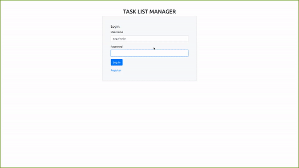
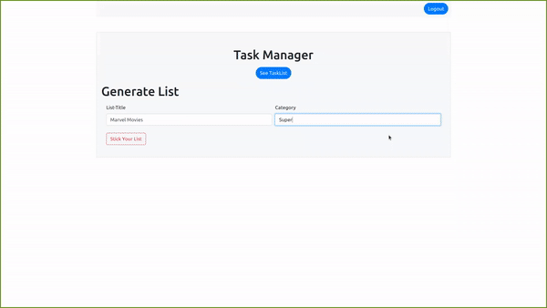
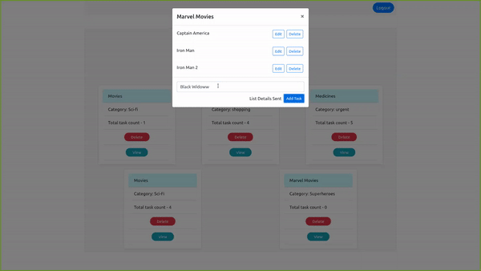

## Project Name: Tasklist Manager

Project Description:

'Tasklist Manager' is single page responsive CRUD application with JWT-Authentication with following features:

- User can register himself and can generate tasklist based on Listname and category

- After generating list user can manage tasks specific to each list.

- User can perform edit,deletion operations on tasks associated with list

Project Stack: HTML,CSS,Bootstrap,JS,React,Redux,Flask,Python,JWT-Authentication
